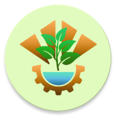

# 🌿 Outil de calcul des bilans carbone des associations des Mines 🌿

## Principe

Le but de cette application est d'aider les associations et les listes des Mines à réaliser leur bilan carbone, en leur fournissant un outil.
Actuellement, ces associations utilisent des tableaux Excel, et l'outil peut être difficile à prendre en main.
Cette application permet une utilisation plus intuitive et plus visuelle.

## Données

Les données sont extraites du site [impactco2](https://impactco2.fr), ce qui garantit d'avoir des statistiques fiables et actualisées.
Elles sont ensuite stockées dans une base de données SQL, au même titre que les associations enregistrées dans l'application.

## Parcours utilisateur

L'utilisateur doit d'abord choisir une association existante ou en créer une nouvelle.
Il doit ensuite choisir une des trois catégories possibles : alimentation, biens ou transport.
Dans chaque cas, l'utilisateur peut ajouter une nouvelle consommation ou modifier une consommation existante.
En revenant en arrière, la masse de carbone émise est affichée.
Il est possible d'aller d'avant en arrière plusieurs fois.
